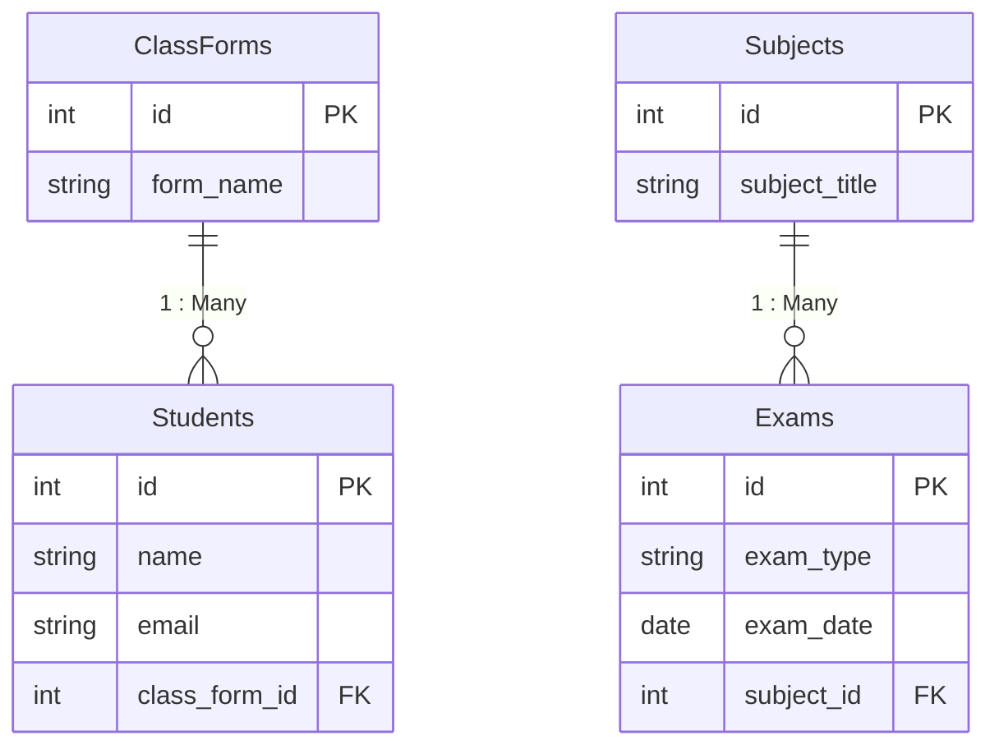

```mermaid
erDiagram
  ClassForms ||--o{ Students : "1 : Many"
  Subjects ||--o{ Exams : "1 : Many"

  ClassForms {
    int id PK
    string form_name
  }

  Students {
    int id PK
    string name
    string email
    int class_form_id FK
  }

  Subjects {
    int id PK
    string subject_title
  }

  Exams {
    int id PK
    string exam_type
    date exam_date
    int subject_id FK
  }
```